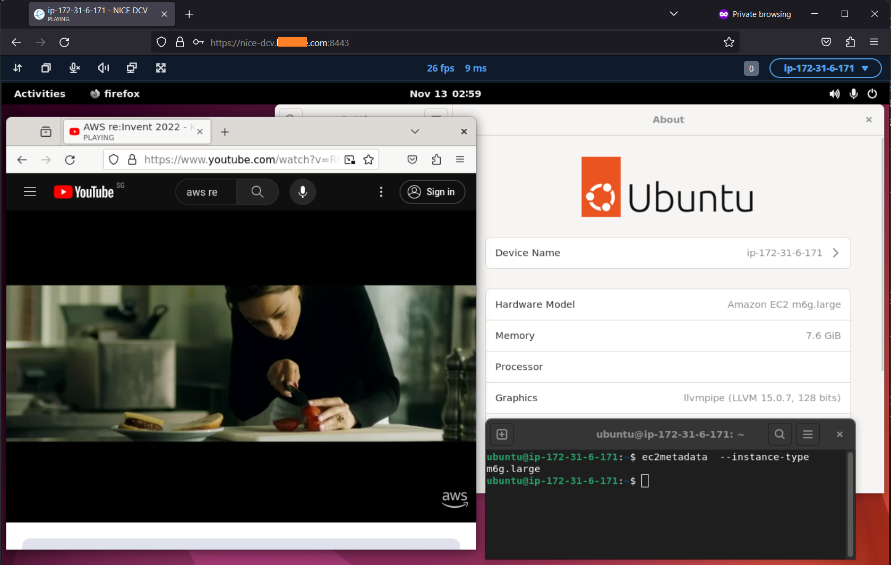

## amazon-ec2-nice-dcv-samples 
Collection of sample [AWS CloudFormation](https://aws.amazon.com/cloudformation/) templates to provision Linux or Windows [Amazon EC2](https://aws.amazon.com/ec2/) instances running [NICE DCV](https://aws.amazon.com/hpc/dcv/) server.

## Description
[NICE DCV](https://aws.amazon.com/hpc/dcv/) is a high-performance remote visualisation protocol that enables users to securely connect to remote desktops and application streaming in the cloud from any device. To use it, [install the NICE DCV](https://docs.aws.amazon.com/dcv/latest/adminguide/setting-up-installing.html) server software on a server and remotely connect to the server using [web browser](https://docs.aws.amazon.com/dcv/latest/userguide/client-web.html) (screenshot below) or [native client application](https://docs.aws.amazon.com/dcv/latest/userguide/client.html). 

NICE DCV client do not require a license while NICE DCV server requires [licensing](https://docs.aws.amazon.com/dcv/latest/adminguide/setting-up-license.html). A license is not required for NICE DCV server on [Amazon EC2](https://aws.amazon.com/ec2/) instances if they can access [Amazon S3](https://aws.amazon.com/s3/) endpoint for [license verification](https://docs.aws.amazon.com/dcv/latest/adminguide/setting-up-license.html#setting-up-license-ec2).

The CloudFormation templates provision EC2 instances running NICE DCV server with the following features:
- [Web browser client](https://docs.aws.amazon.com/dcv/latest/userguide/client-web.html) 
- [Adaptable display resolution](https://docs.aws.amazon.com/dcv/latest/userguide/changing-resolution.html)
- [QUIC UDP transport protocol](https://docs.aws.amazon.com/dcv/latest/adminguide/enable-quic.html)
- [Copy and Paste](https://docs.aws.amazon.com/dcv/latest/userguide/using-copy-paste.html#using-copy-paste-browser)
- [File transfer](https://docs.aws.amazon.com/dcv/latest/userguide/using-transfer-web.html)
- [Audio](https://docs.aws.amazon.com/dcv/latest/adminguide/manage-audio.html)
- [SSM Agent](https://docs.aws.amazon.com/systems-manager/latest/userguide/ssm-agent.html) with [SSM Session Manager](https://docs.aws.amazon.com/systems-manager/latest/userguide/session-manager.html) for changing login password and for [upgrading NICE DCV server](https://docs.aws.amazon.com/dcv/latest/adminguide/setting-up-upgrading.html)
- [AWS CLI v2](https://aws.amazon.com/blogs/developer/aws-cli-v2-is-now-generally-available/) with [auto-prompt](https://docs.aws.amazon.com/cli/latest/userguide/cli-usage-parameters-prompting.html)
- [gp3 or gp2](https://aws.amazon.com/ebs/general-purpose/) volume type with option to specify volume size
- Option to associate static, public IPv4 address via [Elastic IP](https://docs.aws.amazon.com/vpc/latest/userguide/vpc-eips.html)
- Option to specify NICE DCV server TCP/UDP [listen ports](https://docs.aws.amazon.com/dcv/latest/adminguide/manage-port-addr.html) 

## Deployment and using NICE DCV
Refer to [cfn](cfn) section for instructions.

## Security

See [CONTRIBUTING](CONTRIBUTING.md#security-issue-notifications) for more information.

## License

This library is licensed under the MIT-0 License. See the LICENSE file.

## Notice
Usage indicates acceptance of [NICE DCV EULA](https://www.nice-dcv.com/eula.html). Some distributions *are not supported* by NICE DCV.  Refer to [documentation site](https://docs.aws.amazon.com/dcv/latest/adminguide/servers.html#requirements) for information.

