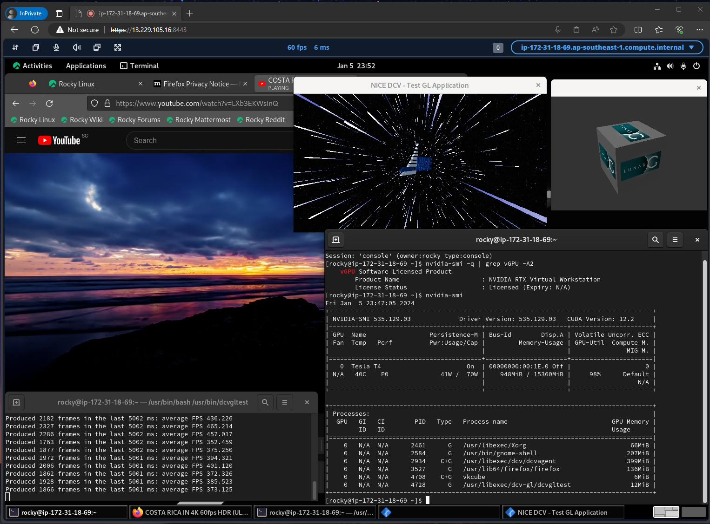

## Notice
Operating systems such as AlmaLinux, Debian, Kali Linux, and those that have reached end of life *are not supported* by DCV and *may not work*. Usage indicates acceptance of [DCV EULA](https://www.amazondcv.com/eula.html) and license agreements of all software that is installed in the EC2 instance. Refer to [DCV documentation](https://docs.aws.amazon.com/dcv/latest/adminguide/servers.html#requirements) for list of supported operating systems.

## About CloudFormation templates
EC2 instances must be provisioned in a subnet with IPv4 internet connectivity. 

For templates that offers x86_64 and arm64 options, ensure that the instance type you specify matches your selected processor architecture.

Verify [availablity](https://docs.aws.amazon.com/AWSEC2/latest/WindowsGuide/instance-discovery.html) of the instance type that you specify. Refer to [Why am I receiving the error "Your requested instance type is not supported in your requested Availability Zone" when launching an EC2 instance?](https://repost.aws/knowledge-center/ec2-instance-type-not-supported-az-error) for more information. 

When using a MarketPlace AMI such as [Rocky Linux](https://aws.amazon.com/marketplace/seller-profile?id=01538adc-2664-49d5-b926-3381dffce12d), [AlmaLinux](https://aws.amazon.com/marketplace/seller-profile?id=529d1014-352c-4bed-8b63-6120e4bd3342), [CentOS](https://aws.amazon.com/marketplace/seller-profile?id=045847c6-6990-4bdb-b490-0b159744e3a4) or [Kali Linux](https://aws.amazon.com/marketplace/seller-profile?id=3fd16b5c-a3f6-43b5-b254-0a6ae8f6a350), subscribe before using. Marketplace AMIs may only support specific instance types, visit the corresponding Marketplace page to view available options.

Check the [On-Demand Instance quota](https://docs.aws.amazon.com/ec2/latest/instancetypes/ec2-instance-quotas.html#on-demand-instance-quotas) value of your desired instance type and request quota increase where necessary.  

NVIDIA [GRID](https://docs.aws.amazon.com/AWSEC2/latest/UserGuide/install-nvidia-driver.html#nvidia-GRID-driver), NVIDIA [Gaming](https://docs.aws.amazon.com/AWSEC2/latest/UserGuide/install-nvidia-driver.html#nvidia-gaming-driver) and [AMD](https://docs.aws.amazon.com/AWSEC2/latest/UserGuide/install-amd-driver.html#download-amd-driver) drivers are for AWS customers only. You are bound by their respective End User License Agreements upon installation of software.

Some Linux templates offer the option to install [Webmin](https://github.com/webmin/webmin) which is released under [BSD-3-Clause](https://github.com/webmin/webmin?tab=BSD-3-Clause-1-ov-file) license. 

## Deployment from CloudFormation console
Download `<OS>-NICE-DCV.yaml` CloudFormation file where `<OS>` is the desired operating system, and login to AWS [CloudFormation console](https://console.aws.amazon.com/cloudformation/home#/stacks/create/template). Start the [Create Stack wizard](https://docs.aws.amazon.com/AWSCloudFormation/latest/UserGuide/cfn-console-create-stack.html#cfn-using-console-initiating-stack-creation) by choosing **Create Stack**. [Select stack template](https://docs.aws.amazon.com/AWSCloudFormation/latest/UserGuide/cfn-using-console-create-stack-template.html) by selecting **Upload a template file**, **Choose File**, select your `.yaml` file and click **Next**. Enter a **Stack name** and specify parameters values. 

### CloudFormation Parameters
In most cases, the default values are sufficient. You will need to specify values for `vpcID`, `subnetID` and `ec2KeyPair` (Linux). For security reasons, configure `ingressIPv4` and `ingressIPv6` to your IP address.

EC2
- `ec2Name` : name of EC2 instance
- `ec2KeyPair` (Linux) : [EC2 key pair](https://docs.aws.amazon.com/AWSEC2/latest/UserGuide/ec2-key-pairs.html) for [SSH access](https://docs.aws.amazon.com/AWSEC2/latest/UserGuide/connect-linux-inst-ssh.html#connect-linux-inst-sshClient). [Create a key pair](https://docs.aws.amazon.com/AWSEC2/latest/UserGuide/create-key-pairs.html) if you do not have one
- `osVersion` (where applicable) : operating system version and processor architecture (Intel/AMD x86_64 or [Graviton](https://aws.amazon.com/ec2/graviton/) arm64). Default is latest version and arm64
- `imageId` (where applicable) : [System Manager Parameter](https://aws.amazon.com/blogs/compute/using-system-manager-parameter-as-an-alias-for-ami-id/) path to AMI ID
-  `instanceType` : appropriate [instance type](https://docs.aws.amazon.com/AWSEC2/latest/UserGuide/instance-types.html).  Default is `t4g.medium` and `t3.medium` for arm64 and x86_64 architecture respectively
- `ec2TerminationProtection` : enable [EC2 termination protection](https://docs.aws.amazon.com/AWSEC2/latest/UserGuide/Using_ChangingDisableAPITermination.html) to prevent accidental deletion. Default is `Yes`

DCV
- `driverType` (Windows) : graphics driver to install
    - [DCV-IDD](https://docs.aws.amazon.com/dcv/latest/adminguide/doc-history-release-notes.html#dcv-2023-1-16220) (Windows Server 2019 or later) : Indirect Display Driver (IDD) that optimizes the graphics pipeline for higher frame rates and significantly reduces overall CPU usage (default)
    - [DCV](https://docs.aws.amazon.com/dcv/latest/adminguide/setting-up-installing-winprereq.html#setting-up-installing-general) (Windows Server 2016)    
    - [NVIDIA-GRID](https://docs.aws.amazon.com/AWSEC2/latest/UserGuide/install-nvidia-driver.html#nvidia-GRID-driver) ([G4dn](https://aws.amazon.com/ec2/instance-types/g4/#Amazon_EC2_G4dn_Instances), [G5](https://aws.amazon.com/ec2/instance-types/g5/), [G6](https://aws.amazon.com/ec2/instance-types/g6/), [G6e](https://aws.amazon.com/ec2/instance-types/g6e/), [Gr6](https://aws.amazon.com/ec2/instance-types/g6/#Product_details) instance) : for professional visualization applications
    - [NVIDIA-Gaming](https://docs.aws.amazon.com/AWSEC2/latest/UserGuide/install-nvidia-driver.html#nvidia-gaming-driver) ([G4dn](https://aws.amazon.com/ec2/instance-types/g4/#Amazon_EC2_G4dn_Instances), [G5](https://aws.amazon.com/ec2/instance-types/g5/) instance) : contain optimizations for gaming
    - [NVIDIA-Tesla](https://docs.aws.amazon.com/AWSEC2/latest/UserGuide/install-nvidia-driver.html#public-nvidia-driver) ([NVIDIA GPU](https://docs.aws.amazon.com/AWSEC2/latest/UserGuide/install-nvidia-driver.html#nvidia-driver-instance-type) instance) : for compute workloads. Use `teslaDriverVersion` to specify the [driver version](https://docs.nvidia.com/datacenter/tesla/index.html) to install. As it operates in headless TCC (Tesla Compute Cluster) [mode](https://docs.nvidia.com/nsight-visual-studio-edition/reference/index.html#setting-tcc-mode-for-tesla-products), IDD driver is also installed
    - [AMD](https://docs.aws.amazon.com/AWSEC2/latest/UserGuide/install-amd-driver.html#download-amd-driver) ([G4ad](https://aws.amazon.com/ec2/instance-types/g4/#Amazon_EC2_G4ad_instances) instance)
    - `none` : do not install any driver

    *IDD, DCV and NVIDIA GRID driver [supports](https://docs.aws.amazon.com/dcv/latest/adminguide/setting-up-installing-winprereq.html#setting-up-installing-general) custom display resolution, up to four monitors and 4K resolution.*

    *NVIDIA GRID and Gaming drivers operate in WDDM (Windows Display Driver Model) mode, and support both compute and graphics workloads.*
  
    *If GPU driver installation does not work, you can select `DCV-IDD` or `none` option, and install driver manually. Refer to [Prerequisites for accelerated computing instances](https://docs.aws.amazon.com/dcv/latest/adminguide/setting-up-installing-winprereq.html#setting-up-installing-graphics) for GPU driver installation and configuration details.*

- `sessionType` (Linux) : `virtual` (default) or `console` [session type](#console-and-virtual-sessions). [GPU driver installation](#gpu-driver-installation) option may be available for some Linux OSs
([AlmaLinux](AlmaLinux-NICE-DCV.yaml), [Amazon Linux 2](AmazonLinux2-NICE-DCV.yaml), [RHEL](RHEL-NICE-DCV.yaml), [Rocky Linux](RockyLinux-NICE-DCV.yaml), [Ubuntu](Ubuntu-NICE-DCV.yaml)) as follows
 
    - `console-with-NVIDIA_GRID_Driver` ([G4dn](https://aws.amazon.com/ec2/instance-types/g4/#Amazon_EC2_G4dn_Instances), [G5](https://aws.amazon.com/ec2/instance-types/g5/), [G6](https://aws.amazon.com/ec2/instance-types/g6/), [G6e](https://aws.amazon.com/ec2/instance-types/g6e/), [Gr6](https://aws.amazon.com/ec2/instance-types/g6/#Product_details) instance) : install [NVIDIA GRID](https://docs.aws.amazon.com/AWSEC2/latest/UserGuide/install-nvidia-driver.html#nvidia-GRID-driver) drivers ([NVIDIA RTX Virtual Workstation (vWS)](https://www.nvidia.com/en-us/design-visualization/virtual-workstation/) mode) 

    - `console-with-NVIDIA_Gaming_Driver` ([G4dn](https://aws.amazon.com/ec2/instance-types/g4/#Amazon_EC2_G4dn_Instances), [G5](https://aws.amazon.com/ec2/instance-types/g5/) instance) : install [NVIDIA Gaming](https://docs.aws.amazon.com/AWSEC2/latest/UserGuide/install-nvidia-driver.html#nvidia-gaming-driver) drivers

    - `console-with-Ubuntu_repo_Driver` (Ubuntu) : install NVIDIA [Enterprise Ready Drivers (ERD)](https://ubuntu.com/server/docs/nvidia-drivers-installation) from Ubuntu repository

    - `*-with-NVIDIA_repo_Driver` (NVIDIA [GPU instances](https://docs.aws.amazon.com/AWSEC2/latest/UserGuide/install-nvidia-driver.html#nvidia-driver-instance-type), e.g. [G5g instance](https://aws.amazon.com/ec2/instance-types/g5g/)) : uses the operating system package manager to install latest [NVIDIA Tesla](https://docs.aws.amazon.com/AWSEC2/latest/UserGuide/install-nvidia-driver.html#public-nvidia-driver) (also known as [NVIDIA Data Center GPU](https://docs.nvidia.com/datacenter/tesla/drivers/index.html)) drivers from [NVIDIA repository](https://docs.nvidia.com/cuda/cuda-installation-guide-linux/#package-manager-installation), and provides access to [CUDA](https://docs.nvidia.com/cuda/cuda-installation-guide-linux/index.html#available-packages), [cuDNN](https://docs.nvidia.com/deeplearning/cudnn/installation/linux.html#additional-package-manager-capabilities) and [NVIDIA Container Toolkit](https://docs.nvidia.com/datacenter/cloud-native/container-toolkit/latest/index.html). Refer to [NVIDIA Driver Installation Guide](https://docs.nvidia.com/datacenter/tesla/driver-installation-guide/index.html#system-requirements) for supported OS (`$distro`) and architecture (`$arch`)

    -  `*-with-NVIDIA_runfile_Driver` (NVIDIA [GPU instances](https://docs.aws.amazon.com/AWSEC2/latest/UserGuide/install-nvidia-driver.html#nvidia-driver-instance-type)) : install NVIDIA Tesla driver using [runfile installer](https://docs.nvidia.com/cuda/cuda-installation-guide-linux/#runfile-installation) from [driver downloads](https://www.nvidia.com/Download/Find.aspx). Use `teslaDriverVersion` to specify the [driver version](https://docs.nvidia.com/datacenter/tesla/index.html) to install

    *Due to various combinations of drivers, OSs and instance types, GPU driver installation may not work. You can [troubleshoot](#troubleshooting) the installation, or select `console` option to install driver manually. Refer to [driver installation scripts](#driver-and-toolkit-installation-scripts) section and [Prerequisites for Linux DCV servers](https://docs.aws.amazon.com/dcv/latest/adminguide/setting-up-installing-linux-prereq.html#linux-prereq-gpu) for GPU driver installation and configuration details.*

- `teslaDriverVersion` (where applicable) : [Tesla driver version](https://docs.nvidia.com/datacenter/tesla/index.html) to install when `NVIDIA-Tesla` or `*-NVIDIA_runfile_Driver` option is selected for `driverType` or `sessionType` respectively.
    - To obtain a suitable version, go to [NVIDIA Driver page](https://www.nvidia.com/en-us/drivers/). Select the **Product Type**, **Product Series**, and **Product** values for your `instanceType` as per [To download a public NVIDIA driver](https://docs.aws.amazon.com/AWSEC2/latest/UserGuide/install-nvidia-driver.html#public-nvidia-driver) table, and select the correct **Operating System**. Click **Search** and copy **Version** value

- `listenPort` : DCV server TCP and UDP [listen ports](https://docs.aws.amazon.com/dcv/latest/adminguide/manage-port-addr.html). Number must be higher than 1024 and default is `8443`

Network
- `vpcID` : [VPC](https://docs.aws.amazon.com/vpc/latest/userguide/what-is-amazon-vpc.html) with internet connectivity. Select [default VPC](https://docs.aws.amazon.com/vpc/latest/userguide/default-vpc.html) if unsure
- `subnetID` : subnet with internet connectivity. Select subnet in default VPC if unsure. If you specify a different `instanceType`, ensure that it is available in AZ subnet you select
- `displayPublicIP` : set this to `No` for EC2 instance in a subnet that will not receive [public IP address](https://docs.aws.amazon.com/AWSEC2/latest/UserGuide/using-instance-addressing.html#concepts-public-addresses). EC2 private IP will be displayed in CloudFormation Outputs section instead. Default is `Yes`
- `assignStaticIP` : associates a static public IPv4 address using [Elastic IP address](https://docs.aws.amazon.com/AWSEC2/latest/UserGuide/elastic-ip-addresses-eip.html) to prevent assigned IPv4 address from changing every time EC2 instance is stopped and started. There is a hourly charge when instance is stopped as listed at [Elastic IP Addresses on Amazon EC2 Pricing, On-Demand Pricing page](https://aws.amazon.com/ec2/pricing/on-demand/#Elastic_IP_Addressesv). Default is `Yes`

Allowed IP prefix and ports
- `ingressIPv4` : allowed IPv4 source prefix to DCV, SSH(Linux), RDP(Windows) and Webmin(Linux) ports, e.g. `1.2.3.4/32`. Get your source IP from [https://checkip.amazonaws.com](https://checkip.amazonaws.com). Default is `0.0.0.0/0`
- `ingressIPv6` : allowed IPv6 source prefix to DCV, SSH(Linux), RDP(Windows) and Webmin(Linux) ports. Use `::1/128` to block all incoming IPv6 access. Default is `::/0`
- `allowRDPport` (Windows) : allow inbound RDP. Option is not related to [Fleet Manager Remote Desktop](https://aws.amazon.com/blogs/mt/console-based-access-to-windows-instances-using-aws-systems-manager-fleet-manager/) access. Default is `No`
- `allowSSHport` (Linux) : allow inbound SSH. Option is not related to [EC2 Instance Connect](https://aws.amazon.com/blogs/compute/new-using-amazon-ec2-instance-connect-for-ssh-access-to-your-ec2-instances/) access. Default is `Yes`
- `allowWebServerPorts` : allow inbound HTTP and/or HTTPS. Use this option if you intend to setup web server. Default is `No`
- `installWebmin` (some Linux OS) : install [Webmin](https://webmin.com/) web-based system administration tool. Default is `No`

EBS
- `volumeSize` : EBS root volume size in GiB
- `volumeType` : `gp2` or `gp3` [general purpose](https://aws.amazon.com/ebs/general-purpose/) EBS type. Default is `gp3`

Backup
- `enableBackup` : EC2 data protection with [AWS Backup](https://aws.amazon.com/backup/). There are charges associated with using this service as listed at [AWS Backup pricing](https://aws.amazon.com/backup/pricing) page. Default is `No`
- `scheduleExpression` : start time of backup using [CRON expression](https://en.wikipedia.org/wiki/Cron#CRON_expression). Default is 1 am daily
- `scheduleExpressionTimezone` : timezone in which the schedule expression is set. Default is `Etc/UTC`
- `deleteAfterDays` :  number of days after backup creation that a recovery point is deleted. Default is `35`

   *Verify AWS Backup [Region availability](https://aws.amazon.com/about-aws/global-infrastructure/regional-product-services/) before enabling this service.*

  
AWS Global Accelerator (AGA)
- `enableAGA` : deploy [AWS Global Accelerator (AGA)](https://aws.amazon.com/global-accelerator/) network accelerator, which can optimize streaming traffic especially when connecting over long distances or over unreliable networks. You can use the [AWS Global Accelerator Speed Comparison Tool](https://speedtest.globalaccelerator.aws) to see the performance difference when transferring data using Global Accelerator. There are charges associated with using this service as listed at [AWS Global Accelerator pricing](https://aws.amazon.com/global-accelerator/pricing/) page. Default is `No`

    *Verify AGA [Region and Availability Zone (AZ) availability](https://docs.aws.amazon.com/global-accelerator/latest/dg/preserve-client-ip-address.regions.html) before enabling this service.* 

Others
- `r53ZoneID` (optional) : [Amazon Route 53](https://aws.amazon.com/route53/) hosted zone ID to grant [EC2 IAM Role](https://docs.aws.amazon.com/AWSEC2/latest/UserGuide/iam-roles-for-amazon-ec2.html) access to, for use by [Certbot](https://eff-certbot.readthedocs.io/en/stable/intro.html)'s [certbot-dns-route53](https://certbot-dns-route53.readthedocs.io/en/stable/) DNS plugin to obtain certificates for [DCV server](https://docs.aws.amazon.com/dcv/latest/adminguide/manage-cert.html) and other applications. A `*` value will grant access to all Route 53 zones in your AWS account. Permission is restricted to **_acme-challenge.\*** TXT DNS records using [resource record set permissions](https://docs.aws.amazon.com/Route53/latest/DeveloperGuide/resource-record-sets-permissions.html). Default is empty string for no access. 

    *Route 53 must be [configured](https://docs.aws.amazon.com/Route53/latest/DeveloperGuide/dns-configuring.html) as DNS service for your domain.*

Continue **Next** with [Configure stack options](https://docs.aws.amazon.com/AWSCloudFormation/latest/UserGuide/cfn-console-add-tags.html), [Review Stack](https://docs.aws.amazon.com/AWSCloudFormation/latest/UserGuide/cfn-using-console-create-stack-review.html), and click **Submit** to launch your stack. 

It may take more than 15 minutes to provision the EC2 instance. After your stack has been successfully created, its status changes to **CREATE_COMPLETE**.

### CloudFormation Outputs and Exports
The following URLs are available in **Outputs** section 
- `SSMsessionManager`* : [SSM Session Manager](https://aws.amazon.com/blogs/aws/new-session-manager/) URL link. Use this to set a strong DCV login user password. Password change command is in *Description* field.
- `DCVwebConsole` : DCV web browser console URL link. Login as user specified in *Description* field. 
- `EC2console` : EC2 console URL link to manage EC2 instance.
- `EC2instanceConnect`* (if available, Linux) : [in-browser SSH](https://aws.amazon.com/blogs/compute/new-using-amazon-ec2-instance-connect-for-ssh-access-to-your-ec2-instances/) URL link. Functionality is available under [certain conditions](https://docs.aws.amazon.com/AWSEC2/latest/UserGuide/connect-linux-inst-eic.html).
- `EC2serialConsole` (Linux): [EC2 Serial Console](https://aws.amazon.com/blogs/aws/troubleshoot-boot-and-networking-issues-with-new-ec2-serial-console/) URL link. Functionality is available under [certain conditions](https://docs.aws.amazon.com/AWSEC2/latest/UserGuide/ec2-serial-console-prerequisites.html).
- `RDPconnect` (Windows) : in-browser [Fleet Manager Remote Desktop](https://aws.amazon.com/blogs/mt/console-based-access-to-windows-instances-using-aws-systems-manager-fleet-manager/) URL link. Use this to update DCV server.
- `WebminUrl` (if available, Linux) : [Webmin](https://webmin.com/) URL link. Set the root password by running `sudo passwd root` from `EC2instanceConnect`, `SSMsessionManager` or SSH session, and login as `root`.

   \* *SSM session manager and EC2 Instance Connect are primarily for remote terminal administration purposes. For best user experience, connect to DCV server using [native clients](#dcv-clients).*

The following are available if `enableAGA` is `Yes`
- `DCVwebConsoleAGA` : DCV web browser console URL link through AGA
- `AGAconsole` : Global Accelerator console URL link
- `AGAipv4Addresses` : IPv4 addresses

    *When [connecting](https://docs.aws.amazon.com/dcv/latest/userguide/using-connecting.html) to AGA using native [Windows](https://docs.aws.amazon.com/dcv/latest/userguide/using-connecting-win.html), [Linux](https://docs.aws.amazon.com/dcv/latest/userguide/using-connecting-linux.html) or [macOS](https://docs.aws.amazon.com/dcv/latest/userguide/using-connecting-mac.html) clients, you may want to explicitly select WebSocket (TCP) protocol. QUIC (UDP) is only supported for direct client-server communication where there are no intermediate proxies, gateways, or load balancers.*

The following values are available as [CloudFormation Exports](https://docs.aws.amazon.com/AWSCloudFormation/latest/UserGuide/using-cfn-stack-exports.html)
- `<Stack Name>-IAMRole` : IAM role name
- `<Stack Name>-InstanceID` : EC2 instance ID
- `<Stack Name>-SecurityGroup` : Security group ID

## Using DCV
Refer to [DCV User Guide](https://docs.aws.amazon.com/dcv/latest/userguide/getting-started.html)

### DCV clients
Besides web browser client, DCV offers Windows, Linux, and macOS native clients with additional features such as [QUIC UDP](https://docs.aws.amazon.com/dcv/latest/adminguide/disable-quic.html), [multi-channel audio](https://docs.aws.amazon.com/dcv/latest/adminguide/manage-audio.html) and [printer redirection support](https://docs.aws.amazon.com/dcv/latest/userguide/using-print.html). Native clients can be download from [https://www.amazondcv.com/](https://www.amazondcv.com/). 

### Remove web browser client
On Linux instances, the web browser client can be disabled by removing `nice-dcv-web-viewer` package. On Windows instances, download [nice-dcv-server-x64-Release.msi](https://d1uj6qtbmh3dt5.cloudfront.net/nice-dcv-server-x64-Release.msi) and run the command *msiexec /i nice-dcv-server-x64-Release.msi REMOVE=webClient* from administrator command prompt.

### USB remotization
DCV supports [USB remotization](https://docs.aws.amazon.com/dcv/latest/adminguide/manage-usb-remote.html), allowing use of specialized USB devices, such as 3D pointing devices and two-factor authentication USB dongles, on Windows and Linux OSs. To use feature on a supported Linux server OS, run the command `sudo dcvusbdriverinstaller` and restart EC2 instance. Feature is for [installable Windows clients](https://docs.aws.amazon.com/dcv/latest/userguide/using-usb.html) only.

### Secure centralized access
If you have a fleet of Amazon DCV servers, you can use [Amazon DCV Connection Gateway](https://docs.aws.amazon.com/dcv/latest/gw-admin/what-is-gw.html) to centralize access. Refer to blog [Getting started with managing NICE DCV sessions secured behind a NICE DCV Connection Gateway](https://aws.amazon.com/blogs/desktop-and-application-streaming/getting-started-with-managing-nice-dcv-sessions-secured-behind-a-nice-dcv-connection-gateway/) and [dcv-samples](https://github.com/aws-samples/dcv-samples) for more information. 

## About Windows template
Default Windows AMI is now Windows Server 2022 English-Full-Base. You can retrieve SSM paths to other AMIs from [Parameter Store console](https://docs.aws.amazon.com/systems-manager/latest/userguide/parameter-store-finding-public-parameters.html#paramstore-discover-public-console), [AWS CloudShell](https://aws.amazon.com/cloudshell/) or [AWS CLI](https://aws.amazon.com/cli/). Refer to [Query for the Latest Windows AMI Using Systems Manager Parameter Store](https://aws.amazon.com/blogs/mt/query-for-the-latest-windows-ami-using-systems-manager-parameter-store/) blog for more information.

### GPU Windows instances
The blog [Building a high-performance Windows workstation on AWS for graphics intensive applications](https://aws.amazon.com/blogs/compute/building-a-high-performance-windows-workstation-on-aws-for-graphics-intensive-applications/) walks through use of [Windows Server template](WIndowsServer-NICE-DCV.yaml) to provision and manage a GPU Windows instance.  

For NVIDIA GPU instances, [CUDA® Toolkit](https://developer.nvidia.com/cuda-toolkit) and [cuDNN (CUDA® Deep Neural Network library)](https://developer.nvidia.com/cudnn) can be downloaded and installed from [https://developer.nvidia.com/cuda-downloads](https://developer.nvidia.com/cuda-downloads?target_os=Windows&target_arch=x86_64&target_version=Server2022) and [https://developer.nvidia.com/cudnn-downloads](https://developer.nvidia.com/cudnn-downloads?target_os=Windows&target_arch=x86_64) respectively.

### Windows screen resolution
Template configures a default Windows screen resolution of 1920 by 1080. If you wish to modify resolution settings, refer to community article [Change Windows EC2 instance default screen resolution](https://repost.aws/articles/ARI3oOjo6OTmqmIoMBfGandg)

### Updating DCV server on Windows
To update DCV Server, connect via Fleet Manager Remote Desktop console using `RDPconnect` link and run `C:\Users\Administrator\update-DCV.cmd`

## About Linux templates
The login user name depends on Linux distributions as follows:
- [AlmaLinux](AlmaLinux-NICE-DCV.yaml), [Amazon Linux 2](AmazonLinux2-NICE-DCV.yaml), [CentOS Stream 9](CentOSstream9-NICE-DCV.yaml), [RHEL](RHEL-NICE-DCV.yaml), [SLES](SLES-NICE-DCV.yaml) : ec2-user
- [CentOS 7](CentOS7-NICE-DCV.yaml) : centos
- [CentOS Stream 8](CentOSstream8-NICE-DCV.yaml) : cloud-user
- [Debian](Debian-NICE-DCV.yaml) : admin
- [Kali Linux](KaliLinux-NICE-DCV.yaml) : kali
- [Rocky Linux](RockyLinux-NICE-DCV.yaml) : rocky
- [Ubuntu, Ubuntu Pro](Ubuntu-NICE-DCV.yaml) : ubuntu

### Console and virtual sessions
DCV offers [console and virtual sessions](https://docs.aws.amazon.com/dcv/latest/adminguide/managing-sessions-intro.html) on Linux OS.

With virtual sessions (`virtual`, `virtual-with-*`), DCV starts an X server instance, `Xdcv`, and runs a desktop environment inside the X server. Multiple user sessions are supported for virtual sessions. Virtual sessions also support custom resolution and [multi-screen](https://docs.aws.amazon.com/dcv/latest/userguide/using-multiple-screens.html) across up to four monitors.

With console sessions  (`console`, `console-with-*`), DCV directly captures the content of the desktop screen. Only one console session can be hosted at a time. 

### GPU Linux instances
DCV server on [supported](https://docs.aws.amazon.com/dcv/latest/adminguide/setting-up-installing-linux-prereq.html#linux-prereq-gpu) [GPU EC2 instances](https://docs.aws.amazon.com/AWSEC2/latest/UserGuide/install-nvidia-driver.html#nvidia-driver-instance-type) with drivers installed (`*-with-NVIDIA-*`) will use GPU for hardware based video encoding. Console sessions have direct access to GPU accelerated OpenCL, OpenGL, and Vulkan. (screen shot below)

There are limits to display resolution and multi-screen support per GPU for console sessions based on selected `sessionType` option:
- Tesla driver (`console-with-NVIDIA_repo_Driver`, `console-with-NVIDIA_runfile_Driver`, `console-with-Ubuntu_repo_Driver`) : one display of up to [2560x1600 resolution](https://docs.nvidia.com/datacenter/tesla/tesla-release-notes-565-57-01/index.html#virtualization)
- Gaming driver (`console-with-NVIDIA_Gaming_Driver`) : one display of up to [4K resolution](https://docs.aws.amazon.com/AWSEC2/latest/UserGuide/install-nvidia-driver.html#nvidia-driver-types)
- GRID driver (`console-with-NVIDIA_GRID_Driver`) : four displays of up to [4K resolution](https://docs.aws.amazon.com/AWSEC2/latest/UserGuide/install-nvidia-driver.html#nvidia-driver-types)

The CloudFormation templates configure *multi-user.target* and *graphical.target* as default [run level](https://tldp.org/LDP/sag/html/run-levels-intro.html) for `virtual*` and `console*` session type options respectively, and increases maximum web client resolution to 4K. 

### NVIDIA CUDA Toolkit, cuDNN and NVIDIA Container Toolkit installation
[CUDA® Toolkit](https://developer.nvidia.com/cuda-toolkit), [cuDNN (CUDA® Deep Neural Network library)](https://developer.nvidia.com/cudnn) and [NVIDIA Container Toolkit](https://docs.nvidia.com/datacenter/cloud-native/container-toolkit/latest/index.html) may subsequently be installed on supported** GPU EC2 instances based on selected `sessionType` option: 

- `*-Ubuntu_repo_Driver`
    - CUDA : `sudo apt install -y nvidia-cuda-toolkit`
    - cuDNN : `sudo apt install -y nvidia-cudnn`
    - Container Toolkit : refer to [https://docs.nvidia.com/datacenter/cloud-native/container-toolkit/latest/install-guide.html](https://docs.nvidia.com/datacenter/cloud-native/container-toolkit/latest/install-guide.html)

- `*-NVIDIA_repo_Driver`

   `<packmgr_cli>` below is the OS package manager command-line tool, e.g.`apt`, `zypper` or `yum`/`dnf` for Ubuntu, SLES and other Linux OSs respectively.

    - CUDA : `sudo <packmgr_cli> install -y cuda-toolkit`
      
      Refer to [CUDA documentation site](https://docs.nvidia.com/cuda/cuda-installation-guide-linux/index.html#additional-package-manager-capabilities) for installation options
    - cuDNN : `sudo <packmgr_cli> install -y cudnn`
    
      Refer to [cuDNN documentation site](https://docs.nvidia.com/deeplearning/cudnn/installation/linux.html#additional-package-manager-capabilities) for installation options
    - Container Toolkit : `sudo <packmgr_cli> install -y nvidia-container-toolkit`
    
      Refer to [NVIDIA Container Toolkit documentation site](https://docs.nvidia.com/datacenter/cloud-native/container-toolkit/latest/install-guide.html#) for installation details

- `*-NVIDIA_runfile_Driver`, `*-NVIDIA_GRID_Driver` or `*-NVIDIA_Gaming_Driver`
    - CUDA : refer to [https://developer.nvidia.com/cuda-downloads](https://developer.nvidia.com/cuda-downloads?target_os=Linux)
    - cuDNN : refer to [https://developer.nvidia.com/cudnn-downloads](https://developer.nvidia.com/cudnn-downloads?target_os=Linux) 
    - Container Toolkit : refer to [https://docs.nvidia.com/datacenter/cloud-native/container-toolkit/latest/install-guide.html](https://docs.nvidia.com/datacenter/cloud-native/container-toolkit/latest/install-guide.html)

**Refer to NVIDIA site for supported CPU architecture and OS:
- [CUDA](https://docs.nvidia.com/cuda/) : [System Requirements](https://docs.nvidia.com/cuda/cuda-installation-guide-linux/index.html#system-requirements)
- [cuDNN](https://docs.nvidia.com/deeplearning/cudnn/) : [CPU Architecture and OS Requirements](https://docs.nvidia.com/deeplearning/cudnn/latest/reference/support-matrix.html#cpu-architecture-and-os-requirements)
- [NVIDIA Container Toolkit](https://docs.nvidia.com/datacenter/cloud-native/container-toolkit/latest/index.html) : [Supported Platforms](https://docs.nvidia.com/datacenter/cloud-native/container-toolkit/latest/supported-platforms.html)

#### Driver and Toolkit installation scripts 
NVIDIA driver, CUDA Toolkit, NVIDIA Container Toolkit, and Docker installation/configuration scripts are available from the following [re:Post](https://repost.aws/) community articles:
- [How do I install NVIDIA GPU driver, CUDA Toolkit, NVIDIA Container Toolkit on Amazon EC2 instances running Amazon Linux 2 (AL2)?](https://repost.aws/articles/ARR29omO1-S5OfOPQKD904Jg/how-do-i-install-nvidia-gpu-driver-cuda-toolkit-nvidia-container-toolkit-on-amazon-ec2-instances-running-amazon-linux-2-al2)
- [How do I install NVIDIA GPU driver, CUDA toolkit, NVIDIA Container Toolkit on Amazon EC2 instances running Amazon Linux 2023 (AL2023)?](https://repost.aws/articles/ARwfQMxiC-QMOgWykD9mco1w/how-do-i-install-nvidia-gpu-driver-cuda-toolkit-nvidia-container-toolkit-on-amazon-ec2-instances-running-amazon-linux-2023-al2023)
- [How do I install NVIDIA GPU driver, CUDA Toolkit, NVIDIA Container Toolkit on Amazon EC2 instances running RHEL/Rocky Linux 8/9?](https://repost.aws/articles/ARpmJcNiCtST2A3hrrM_4R4A/how-do-i-install-nvidia-gpu-driver-cuda-toolkit-nvidia-container-toolkit-on-amazon-ec2-instances-running-rhel-rocky-linux-8-9)
- [How do I install NVIDIA GPU driver, CUDA Toolkit, NVIDIA Container Toolkit on Amazon EC2 instances running Ubuntu Linux?](https://repost.aws/articles/ARWGxLArMBQ4y1MKoSHTq3gQ/how-do-i-install-nvidia-gpu-driver-cuda-toolkit-nvidia-container-toolkit-on-amazon-ec2-instances-running-ubuntu-linux)

### Updating DCV server on Linux
You can use update scripts (`update-dcv`, `update-awscli`) in */home/{user name}* folder from SSM Session Manager or EC2 Instance Connect to update DCV and AWS CLI. 

### Troubleshooting
To troubleshoot any installation issue, you can view contents of the following log files
- `/var/log/cloud-init-output.log`
- `/var/log/install-cfn-helper.log`
- `/var/log/install-dcv.log`
- `/var/log/install-sw.log`
- if GPU driver install option is selected
  - `/var/log/install-gpu-driver.log`
  - `/var/log/nvidia-installer.log` (NVIDIA GRID, Gaming and Tesla driver)

## About EC2
### Private subnet
The CloudFormation templates are designed to provision EC2 instances in [public subnet](https://docs.aws.amazon.com/vpc/latest/userguide/VPC_Scenario1.html). To use them for EC2 instances in [private subnets](https://docs.aws.amazon.com/vpc/latest/userguide/VPC_Scenario2.html) with internet connectivity, set `displayPublicIP` and `assignStaticIP` parameter values to `No`.

### Local Zones
To use templates in [AWS Local Zones](https://aws.amazon.com/about-aws/global-infrastructure/localzones/), verify [available services features](https://aws.amazon.com/about-aws/global-infrastructure/localzones/features/) and adjust CloudFormation parameters accordingly. You may have to change `osVersion`, `instanceType` and `volumeType`, and set `assignStaticIP` to `No`.

### Securing
To futher secure your EC2 instance, you may want to
- [Remove web browser client](#remove-web-browser-client) and use [native client](https://download.amazondcv.com/)
- Restrict DCV/SSH/RDP/Webmin access to your IP address only (`ingressIPv4` and `ingressIPv6`).
- Linux: Disallow SSH (`allowSSHport`) access from public internet. Use [EC2 Instance Connect](https://docs.aws.amazon.com/AWSEC2/latest/UserGuide/ec2-instance-connect-methods.html#ec2-instance-connect-connecting-console) or [SSM Session Manager](https://docs.aws.amazon.com/systems-manager/latest/userguide/session-manager-working-with-sessions-start.html#start-ec2-console) for in-browser terminal access. 
  If you have [AWS CLI](https://docs.aws.amazon.com/cli/latest/userguide/getting-started-install.html) and [Session Manager plugin for the AWS CLI](https://docs.aws.amazon.com/systems-manager/latest/userguide/session-manager-working-with-install-plugin.html) installed, you can start a terminal session using [AWS CLI](https://docs.aws.amazon.com/systems-manager/latest/userguide/session-manager-working-with-sessions-start.html#sessions-start-cli) or [SSH](https://docs.aws.amazon.com/systems-manager/latest/userguide/session-manager-working-with-sessions-start.html#sessions-start-ssh).
- Windows: Disallow RDP (`allowRDPport`) access from public internet. Use [Fleet Manager Remote Desktop](https://aws.amazon.com/blogs/mt/console-based-access-to-windows-instances-using-aws-systems-manager-fleet-manager/) for in-browser RDP access.
- Use [AWS Backup](https://aws.amazon.com/blogs/aws/aws-backup-ec2-instances-efs-single-file-restore-and-cross-region-backup/) and enable [AWS Backup Vault Lock](https://aws.amazon.com/blogs/storage/enhance-the-security-posture-of-your-backups-with-aws-backup-vault-lock/) for enhanced data protection. If your [Region](https://aws.amazon.com/about-aws/global-infrastructure/regional-product-services/) does not support AWS Backup, you can setup automatic [EBS snapshots](https://docs.aws.amazon.com/AWSEC2/latest/UserGuide/EBSSnapshots.html) using [Amazon Data Lifecycle Manager](https://aws.amazon.com/blogs/storage/automating-amazon-ebs-snapshot-and-ami-management-using-amazon-dlm/).
- Enable [Amazon Inspector](https://aws.amazon.com/inspector/) to scan EC2 instance for software vulnerabilities and unintended network exposure.
- Enable [Amazon GuardDuty](https://aws.amazon.com/guardduty/) security monitoring service with [Malware Protection](https://docs.aws.amazon.com/guardduty/latest/ug/malware-protection.html) to detect the potential presence of malware in EBS volumes.
- If you are hosting a website, use [Amazon CloudFront](https://aws.amazon.com/cloudfront/) with [AWS WAF](https://docs.aws.amazon.com/AmazonCloudFront/latest/DeveloperGuide/distribution-web-awswaf.html) to protect your instance from DDoS and common web attacks. The [Accelerate and protect your websites using Amazon CloudFront and AWS WAF](https://aws.amazon.com/blogs/networking-and-content-delivery/accelerate-and-protect-your-websites-using-amazon-cloudfront-and-aws-waf/) blog post and [CloudFront dynamic websites](https://github.com/aws-samples/amazon-cloudfront-dynamic-websites) CloudFormation template may help with CloudFront distribution setup. When using CloudFront, you can restrict your EC2 instance HTTP and HTTPS port access to CloudFront IPs only. The CloudFormation template creates additional inbound HTTP and HTTPS security groups with [AWS-managed prefix list for Amazon CloudFront](https://aws.amazon.com/blogs/networking-and-content-delivery/limit-access-to-your-origins-using-the-aws-managed-prefix-list-for-amazon-cloudfront/) as source where possible. 

## Using Cloudwatch agent
[Amazon CloudWatch agent](https://docs.aws.amazon.com/AmazonCloudWatch/latest/monitoring/Install-CloudWatch-Agent.html) is installed in the EC2 instance, and enables collection of [EC2 system-level metrics](https://docs.aws.amazon.com/AmazonCloudWatch/latest/monitoring/metrics-collected-by-CloudWatch-agent.html) and [AWS X-Ray](https://aws.amazon.com/xray/) traces. The template configures agent to collect memory utilization metrics. You can configure Cloudwatch agent to collect other data as follows.

### Create agent configuration file
Before running, create agent configuration file. You can use [agent configuration file wizard](https://docs.aws.amazon.com/AmazonCloudWatch/latest/monitoring/create-cloudwatch-agent-configuration-file-wizard.html):

- Linux:
    - `sudo /opt/aws/amazon-cloudwatch-agent/bin/amazon-cloudwatch-agent-config-wizard`
- Windows PowerShell:
    - `cd "C:\Program Files\Amazon\AmazonCloudWatchAgent"`
    - `.\amazon-cloudwatch-agent-config-wizard.exe`

### Start Cloudwatch agent
After `config.json` file is created, [start CloudWatch agent](https://docs.aws.amazon.com/AmazonCloudWatch/latest/monitoring/install-CloudWatch-Agent-on-EC2-Instance-fleet.html#start-CloudWatch-Agent-EC2-fleet):

- Linux:
    - `sudo systemctl enable amazon-cloudwatch-agent`
    - `sudo /opt/aws/amazon-cloudwatch-agent/bin/amazon-cloudwatch-agent-ctl -a fetch-config -m ec2 -s -c file:/opt/aws/amazon-cloudwatch-agent/bin/config.json`
- Windows PowerShell:
   - `sc.exe config AmazonCloudWatchAgent start=auto`
   - `cd "C:\Program Files\Amazon\AmazonCloudWatchAgent"`
   - `.\amazon-cloudwatch-agent-ctl.ps1 -a fetch-config -m ec2 -c file:config.json`
   - `net.exe start AmazonCloudWatchAgent`

Refer to [How do I install and configure the unified CloudWatch agent to push metrics and logs from my EC2 instance to CloudWatch?](https://repost.aws/knowledge-center/cloudwatch-push-metrics-unified-agent) for more details.

## Clean Up
To remove created resources,
- [Disable](https://docs.aws.amazon.com/AWSEC2/latest/UserGuide/Using_ChangingDisableAPITermination.html) EC2 instance termination protection (if enabled)
- [Delete](https://docs.aws.amazon.com/aws-backup/latest/devguide/deleting-backups.html) any recovery points in created backup vault
- [Delete](https://docs.aws.amazon.com/AWSCloudFormation/latest/UserGuide/cfn-console-delete-stack.html) CloudFormation stack
